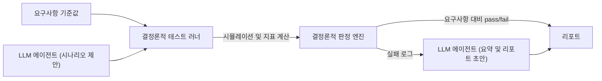

# Quadrotor GNC Simulation & Verification Stack

[🇺🇸 English](README.md) | 🇰🇷 한국어

쿼드콥터 GNC 시뮬레이션 스택 — 6DOF 비선형 동역학, PID 자세제어, 그리고 고전적
기법(EKF, augmented-state EKF)과 physics-informed 상태추정을 공정하게 비교하고,
이를 명시적 요구사항 기준으로 검증하는 자동화 하네스(LLM 에이전트는 보조만 하고
최종 판정은 절대 하지 않음)까지 갖춘 프로젝트.

## 진행 상황
🚧 초기 개발 단계 — 6DOF 동역학 구현 진행 중 (쿼터니언 자세 기구학 완료,
강체 운동방정식 · 모터 믹싱 · PID 자세제어가 다음 단계).

## 이 프로젝트가 하는 일
- **6DOF 강체 동역학**: 뉴턴-오일러 운동방정식(병진+회전)과 쿼터니언 자세 기구학
  구현 — 오일러각만 쓰는 시뮬레이션이 겪는 짐벌락 특이점을 피함.
- **PID 자세제어**: 쿼터니언 오차 기반 자세제어, 각속도 피드백(derivative kick
  없음), anti-windup 적용.
- **공정하게 비교되는 상태추정**: nominal EKF, augmented-state EKF(바이어스/외란
  상태 포함), physics-informed 잔차 추정기를 동일 조건에서 비교 — 어느 한쪽이
  이기도록 baseline을 일부러 약화시키지 않음.
- **외란 · 센서 모델**: IMU bias, GPS dropout, 단순화된 풍외란 모델.
- **평가**: Monte Carlo 시나리오 스윕을 median/95th percentile/worst-case로
  리포팅하고, 명시적 요구사항(ID/기준/검증방법)에 연결.

## 폴더 구조
```
dynamics/       6DOF 강체 동역학 모델
estimation/     EKF, augmented-state EKF, physics-informed 추정기
control/        PID 자세제어기
requirements/   요구사항 정의 (ID / 기준 / 검증방법)
scenarios/      외란 · 센서고장 시나리오, Monte Carlo 설정
tests/          단위 테스트
reports/        생성된 V&V 리포트
config/         설정 파일
```

## 시작하기
```bash
python -m venv .venv
source .venv/Scripts/activate   # Linux/Mac은 .venv/bin/activate
pip install -e ".[dev]"
pytest
```

## 검증 하네스
요구사항 기준값이 자동화된 하네스를 구동한다. LLM 에이전트는 (1) 시험 시나리오
후보 제안, (2) 실패 로그를 요약해 리포트 초안 작성 — 이 두 가지 용도로만
사용되며, pass/fail 최종 판정에는 관여하지 않는다 — 판정은 결정론적 코드가
요구사항 대비로 전담한다.



## 개발 프로세스
구현 단계마다 정해진 하루 루틴을 따른다: 먼저 이론을 공부하고(키워드 정리 후
설명, 개인 작업 노트로 보관) → 그 부분을 직접 손으로 구현 → unit test로 검증 →
커밋. 커밋 히스토리도 이 순서를 그대로 반영한다 (`feat(day-N)`은 구현,
`test(day-N)`은 그 테스트) — 로그 자체가 "이론을 이해한 뒤 코드를 짰고, 코드는
검증된 뒤에야 완료로 친다"는 순서를 보여준다.

## 한계 및 향후 과제 (Limitations / Future Work)
- 실시간 C/C++ 임베디드 구현 (현재는 Python 시뮬레이션만)
- HIL(Hardware-in-the-Loop) 시험
- 완전한 CI/CD 파이프라인 및 코드 커버리지 도구
- DO-178C 수준의 요구사항 추적성
- 더 폭넓은 안전성 분석 (센서 고장, 단일 모터 열화, 위험요소 연결)
- 추가 baseline (adaptive EKF / UKF, hybrid residual estimator)
