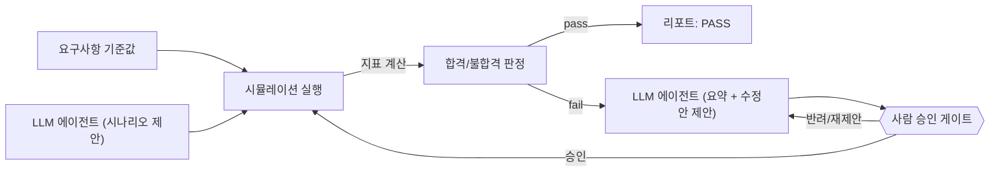

# Quadrotor GNC Simulation & Verification Stack

[🇺🇸 English](README.md) | 🇰🇷 한국어

쿼드콥터 GNC 시뮬레이션 스택 — 6DOF 비선형 동역학, PID 자세제어, 그리고 고전적
기법(EKF, augmented-state EKF)과 physics-informed 상태추정을 공정하게 비교하고,
이를 명시적 요구사항 기준으로 검증하는 자동화 하네스까지 갖춘 프로젝트.

## 진행 상황
🏗️ Phase 1(동역학+자세제어, 모터 믹싱·actuator saturation 포함) 완료. 2주차
외란·센서 모델링도 완료 — IMU(자이로+가속도계) 노이즈/바이어스, GPS 위치
dropout, 단순화된 풍외란 힘까지 전부 폐루프 시뮬레이션에 연결하고
unit/integration 테스트 55개로 검증했음. 상태추정(EKF/physics-informed)과
요구사항 기반 V&V 하네스는 아직 시작 전 (아래 "계획" 참고).

## 이 프로젝트가 하는 일

### 구현 및 검증 완료
- **6DOF 강체 동역학**: 뉴턴-오일러 운동방정식(병진+회전)과 쿼터니언 자세 기구학
  구현 — 오일러각만 쓰는 시뮬레이션이 겪는 짐벌락 특이점을 피함.
- **PID 자세제어**: 쿼터니언 오차 기반 자세제어, 각속도 피드백(derivative kick
  없음), anti-windup 적용.
- **폐루프 자세 안정화**: 컨트롤러와 동역학을 연결하고, 오버슈트/정착시간 진단에
  근거해 게인을 튜닝 — 수렴 기준 및 쿼터니언 unit-norm 불변성을 통합 테스트로
  검증.
- **모터 믹싱 & actuator saturation**: 원하는 추력/토크를 모터별 명령으로
  변환하고 액추에이터 한계로 클리핑 — 포화 전/후 비교를 문서화.
- **센서 모델**: 자이로스코프·가속도계 모델(화이트 노이즈 + bias 랜덤워크)을
  폐루프 각속도 피드백에 연결, GPS 위치 모델은 dropout 확률을 설정 가능.
- **풍외란**: steady + gust(랜덤워크) 구조의 단순화된 외력 모델을 강체
  동역학의 병진 방정식에 직접 주입 — 측정값을 왜곡하는 게 아니라 실제
  궤적 자체를 밀어냄. 자세 수렴은 영향받지 않고 위치만 밀리는 것을,
  회전/병진 방정식이 서로 결합되지 않은 모델 구조와 일치하게 검증함.

### 계획 (아직 구현 안 됨)
- 공정하게 비교되는 상태추정: nominal EKF, augmented-state EKF(바이어스/외란
  상태 포함), physics-informed 잔차 추정기를 동일 조건에서 비교
- 요구사항 기반 평가: Monte Carlo 시나리오 스윕을 median/95th percentile/
  worst-case로 리포팅 & 명시적 요구사항(ID/기준/검증방법)에 연결
- 자동 검증 하네스 자체

## 폴더 구조
```
dynamics/       6DOF 강체 동역학 모델
estimation/     EKF, augmented-state EKF, physics-informed 추정기
control/        PID 자세제어기
requirements/   요구사항 정의 (ID / 기준 / 검증방법)
scenarios/      외란 · 센서고장 시나리오, Monte Carlo 설정
tests/          단위 테스트
reports/        생성된 V&V 리포트
config/         설정 파일
```

## 시작하기
```bash
python -m venv .venv
source .venv/Scripts/activate   # Linux/Mac은 .venv/bin/activate
pip install -e ".[dev]"
pytest
```

## 검증 하네스 (계획)
아직 구현 안 됨 — 예정 설계 계획. 시나리오 지표가 기준을 만족할 때까지 아래
루프를 반복한다:

1. LLM 에이전트가 시험 시나리오 후보를 제안한다.
2. 코드로 시뮬레이션을 실행하고 지표를 계산한다.
3. 그 지표를 요구사항 기준값과 비교해 pass/fail을 판정.
4. LLM 에이전트는 시험이 실패한 원인을 요약하고 수정안을 제안한다. (요구사항 기준값을 완화하는 제안은 하지 않는다)
5. 사람이 제안된 수정안을 검토한다.
6. 승인되면 수정안이 반영되고 2번부터 시나리오를 다시 돌린다 — pass할 때까지 반복.



## 한계 및 향후 과제 (Limitations / Future Work)
- 실시간 C/C++ 임베디드 구현 (현재는 Python 시뮬레이션만)
- HIL(Hardware-in-the-Loop) 시험
- 완전한 CI/CD 파이프라인 및 코드 커버리지 도구
- DO-178C 수준의 요구사항 추적성
- 더 폭넓은 안전성 분석 (센서 고장, 단일 모터 열화, 위험요소 연결)
- 추가 baseline (adaptive EKF / UKF, hybrid residual estimator)
