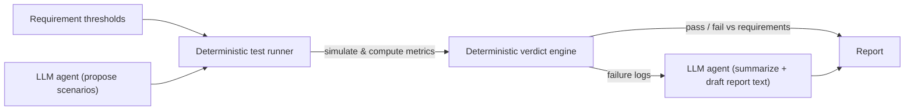

# Quadrotor GNC Portfolio

🇺🇸 English | [🇰🇷 한국어](README.ko.md)

A quadrotor GNC simulation stack — 6DOF nonlinear dynamics, PID attitude control,
and a fair comparison of classical (EKF, augmented-state EKF) vs. physics-informed
state estimation — verified against explicit requirements through an automated
harness where an LLM agent assists but never decides the verdict.

## Status
🚧 Early development — 6DOF dynamics in progress (quaternion attitude kinematics
complete; rigid-body equations of motion, motor mixing, and PID attitude control
next).

## What this project does
- **6DOF rigid-body dynamics**: Newton-Euler equations of motion (translational +
  rotational) with quaternion attitude kinematics, avoiding the gimbal-lock
  singularity that Euler-angle-only simulations hit.
- **PID attitude control**: quaternion-error-based attitude control with rate
  feedback (no derivative kick) and anti-windup.
- **State estimation, compared fairly**: a nominal EKF, an augmented-state EKF
  (bias/disturbance states included), and a physics-informed residual estimator,
  evaluated against each other under identical conditions — no baseline is
  deliberately weakened to make another one look better.
- **Disturbance & sensor models**: IMU bias, GPS dropout, and a simplified wind
  disturbance model.
- **Evaluation**: Monte Carlo scenario sweeps reported as median / 95th percentile
  / worst-case, tied to explicit requirements (ID, threshold, verification method).

## Structure
```
dynamics/       6DOF rigid-body dynamics model
estimation/     EKF, augmented-state EKF, physics-informed estimator
control/        PID attitude controller
requirements/   Requirement definitions (ID / threshold / verification method)
scenarios/      Disturbance & sensor-fault scenarios, Monte Carlo configs
tests/          Unit tests
reports/        Generated V&V reports
config/         Configuration files
```

## Getting started
```bash
python -m venv .venv
source .venv/Scripts/activate   # or .venv/bin/activate on Linux/Mac
pip install -e ".[dev]"
pytest
```

## Verification harness
Requirement thresholds drive an automated harness. An LLM agent is used only to
(1) propose test-scenario candidates and (2) summarize failure logs into a draft
report — it never touches the pass/fail verdict, which deterministic code alone
computes against the requirements.



## Development process
Each implementation step follows a fixed daily loop: study the underlying theory
first (keywords, then explanations, kept as private working notes), implement
that piece by hand, verify it with unit tests, then commit. Commit history is
structured to reflect this (`feat(day-N)` for the implementation, `test(day-N)`
for its tests), so the log itself traces the build order: theory understood
before code, code verified before it's considered done.

## Limitations / Future Work
- Real-time C/C++ embedded implementation (currently Python simulation only)
- Hardware-in-the-Loop (HIL) testing
- Full CI/CD pipeline and code coverage tooling
- DO-178C-style requirements traceability
- Broader safety analysis (sensor faults, single-motor degradation, hazard linkage)
- Additional baselines (adaptive EKF / UKF, hybrid residual estimator)
