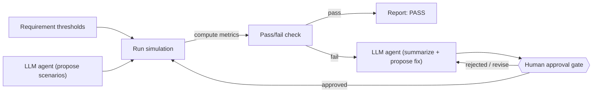

# Quadrotor GNC Simulation & Verification Stack

🇺🇸 English | [🇰🇷 한국어](README.ko.md)

A quadrotor GNC simulation stack — 6DOF nonlinear dynamics, PID attitude control,
and a fair comparison of classical (EKF, augmented-state EKF) vs. physics-informed
state estimation — verified against explicit requirements through an automated
harness where an LLM agent assists but never decides the verdict.

## Status
🏗️ Phase 1 (dynamics + attitude control) complete — 6DOF rigid-body dynamics, PID
attitude control, and a closed-loop stabilization simulation with documented gain
tuning, verified by 27 passing unit/integration tests. Motor mixing & actuator
saturation are in progress next; state estimation and the requirements-based V&V
harness haven't been started yet (see Planned below).

## What this project does

### Built & verified
- **6DOF rigid-body dynamics**: Newton-Euler equations of motion (translational +
  rotational) with quaternion attitude kinematics, avoiding the gimbal-lock
  singularity that Euler-angle-only simulations hit.
- **PID attitude control**: quaternion-error-based attitude control with rate
  feedback (no derivative kick) and anti-windup.
- **Closed-loop attitude stabilization**: controller and dynamics wired together
  and gain-tuned against a documented overshoot/settling-time diagnosis, checked
  by integration tests (convergence bound, quaternion unit-norm invariant).

### Planned (not yet implemented)
- Motor mixing and actuator saturation in the closed loop (in progress)
- State estimation, compared fairly: a nominal EKF, an augmented-state EKF
  (bias/disturbance states included), and a physics-informed residual estimator,
  evaluated against each other under identical conditions — no baseline will be
  deliberately weakened to make another one look better
- Disturbance & sensor models: IMU bias, GPS dropout, and a simplified wind
  disturbance model
- Requirements-based evaluation: Monte Carlo scenario sweeps reported as
  median / 95th percentile / worst-case, tied to explicit requirements (ID,
  threshold, verification method)
- The automated verification harness itself (see diagram below — describes the
  intended design, not yet built)

## Structure
```
dynamics/       6DOF rigid-body dynamics model
estimation/     EKF, augmented-state EKF, physics-informed estimator
control/        PID attitude controller
requirements/   Requirement definitions (ID / threshold / verification method)
scenarios/      Disturbance & sensor-fault scenarios, Monte Carlo configs
tests/          Unit tests
reports/        Generated V&V reports
config/         Configuration files
```

## Getting started
```bash
python -m venv .venv
source .venv/Scripts/activate   # or .venv/bin/activate on Linux/Mac
pip install -e ".[dev]"
pytest
```

## Verification harness (planned)
Not yet implemented — intended design only. "Deterministic" here just means
plain code, not an LLM — same input, same output. Loops until a scenario's
metrics pass:

1. LLM agent proposes candidate test scenarios.
2. Code runs the simulation and computes metrics.
3. Code checks metrics against requirement thresholds, decides pass/fail.
4. On failure, LLM agent summarizes why and proposes a fix — never loosens
   the requirement threshold itself to make it pass.
5. A human reviews the proposed fix.
6. If approved, the fix is applied and the scenario re-runs from step 2 —
   repeat until it passes.



## Limitations / Future Work
- Real-time C/C++ embedded implementation (currently Python simulation only)
- Hardware-in-the-Loop (HIL) testing
- Full CI/CD pipeline and code coverage tooling
- DO-178C-style requirements traceability
- Broader safety analysis (sensor faults, single-motor degradation, hazard linkage)
- Additional baselines (adaptive EKF / UKF, hybrid residual estimator)
